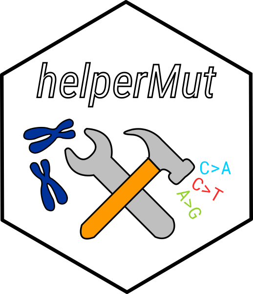
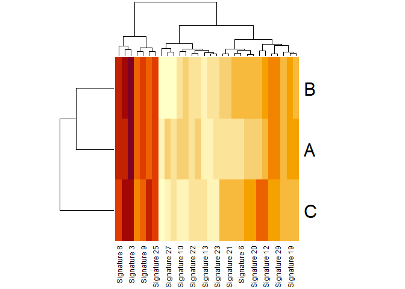

<!-- README.md is generated from README.Rmd. Please edit that file -->

# helperMut <a href=''></a>

<!-- badges: start -->

[](https://travis-ci.com/davidmasp/helperMut)
[](https://codecov.io/gh/davidmasp/helperMut)
[](https://www.tidyverse.org/lifecycle/#experimental)
<!-- badges: end -->

## Overview

helperMut provides basic functionalities and helper functions to work
with mutational and genomic data in R. It builds up on pre-existing
tools from bioc to set up a framework for analysis. I mostly use it for
my work in cancer genomics but in principle any other field working in
mutations or population diversity could be used.

## Installation

In order to install the package use:

``` r
## If still private, make sure that there is a enviroment variable (.Renviron)
## with the token (PAT). The name of the variable should be GITHUB_PAT
remotes::install_github("davidmasp/helpermut@develop")
```

You need to first install the
[remotes](https://cran.r-project.org/web/packages/remotes/index.html)

## Usage

### Simplify mutation codes

``` r
mutations = c("TCA>T","TGA>A")
simplify_muts(mutations)
#> [1] "TCA>T" "TCA>T"
```

### Cosine similarities from Cosmic signatures

``` r
# generate 3 random sigs
set.seed(42)
de_novo_sig = runif(n = 96*3,min = 0,max = 1)
de_novo_sig = matrix(de_novo_sig, ncol = 3)
rownames(de_novo_sig) = generate_mut_types(k = 1)
colnames(de_novo_sig) = LETTERS[1:3]

cosmic_sigs = download_signature_set(version =  "v2")

res = compare_signature_sets(x = de_novo_sig,y = cosmic_sigs)
heatmap(res)
```

<!-- -->

### Colors and Plots

The standard colors used for mutational profiles in papers are available
as a variable.

``` r
tr_colors
#>       C>G       C>A       C>T       A>T       A>G       A>C 
#> "#000000" "#00ceff" "#ff2926" "#c9c9c9" "#95d230" "#ffbebe"

tr_colors_ct = tr_colors
names(tr_colors_ct) = simplify_muts(names(tr_colors_ct),
                                    simplify_set = c("C","T"))

tr_colors_ct
#>       C>G       C>A       C>T       T>A       T>C       T>G 
#> "#000000" "#00ceff" "#ff2926" "#c9c9c9" "#95d230" "#ffbebe"
```

## Other relevant packages

Some functionalities implemented in this packages are also available in
other packages from bioconductor. Hopefully, the current implementation
in this package will have an added value to the user.

  - [SomaticSignatures](http://bioconductor.org/packages/release/bioc/html/SomaticSignatures.html)
    It extracts Mutation Subtype information from VCFs (restricted to a
    defined ctx). It also performs NMF/PCA signature extraction which is
    not covered in helperMut.
  - [MutationalPatterns](http://bioconductor.org/packages/release/bioc/html/MutationalPatterns.html)
    Same as somaticSignatures.
  - [YAPSA](https://github.com/eilslabs/YAPSA) Yet Another Package for
    Signature Analysis
  - [signature.tools.lib](https://github.com/Nik-Zainal-Group/signature.tools.lib)

## Contribute

If you want to contribute to the package, please fork the repo and
submit a PR. Currently the package is under development so no features
are explicitily requested.
